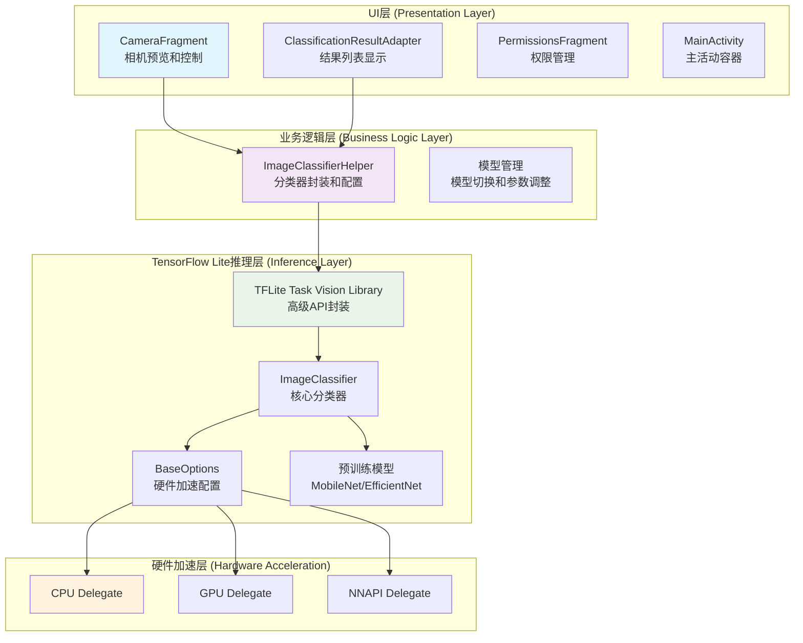
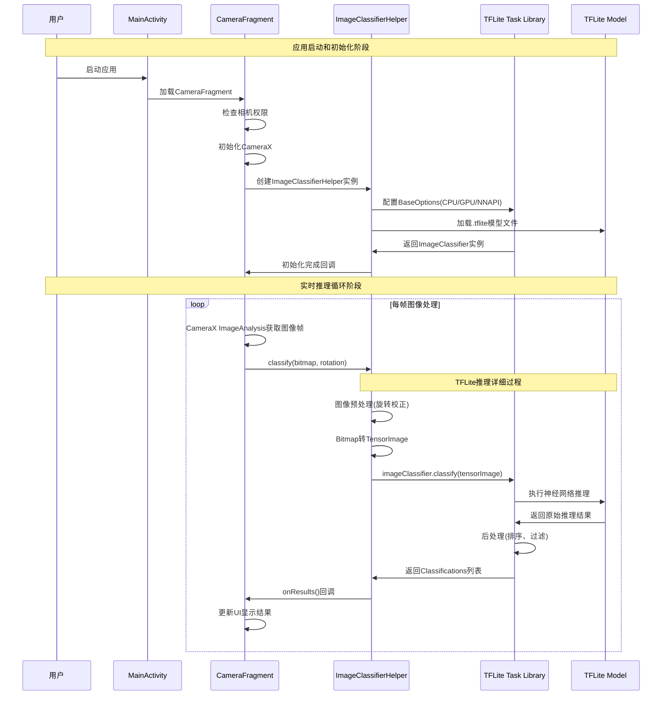
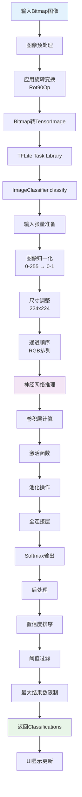
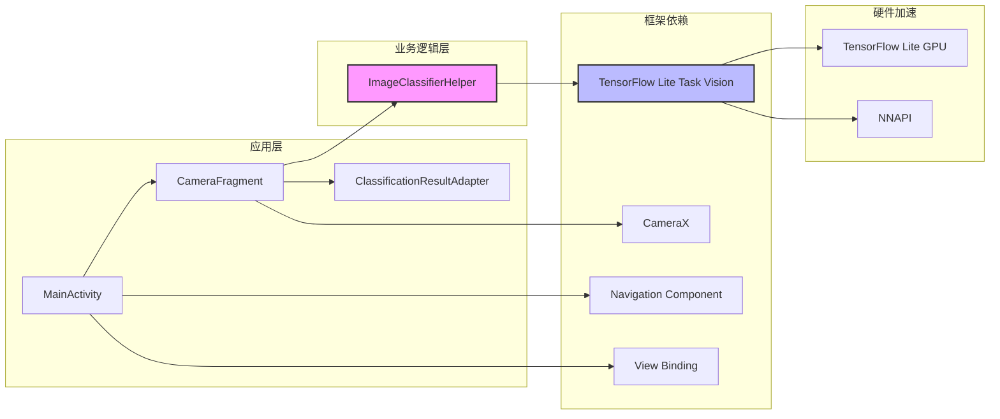

# 项目介绍：TFLite 图像分类 Android 示例

## 1. 项目基本介绍

本项目是一个基于 TensorFlow Lite (TFLite) 的 Android 图像分类应用程序。它演示了如何使用 TFLite 在 Android 设备上对图像进行实时分类。

该应用程序的主要功能包括：

*   从设备的摄像头实时捕获视频流
*   使用预训练的 TFLite 模型对捕获的图像进行分类
*   在界面上显示分类结果和置信度
*   允许用户切换不同的模型（MobileNet V1, EfficientNet Lite0/1/2）和推理设备（CPU, GPU, NNAPI）
*   支持动态调整推理参数（线程数、置信度阈值、最大结果数）

### 1.1 支持的模型

项目支持以下预训练模型：
- **MobileNet V1** (`mobilenetv1.tflite`) - 轻量级模型，适合资源受限设备
- **EfficientNet Lite0** (`efficientnet-lite0.tflite`) - 平衡精度和效率
- **EfficientNet Lite1** (`efficientnet-lite1.tflite`) - 更高精度
- **EfficientNet Lite2** (`efficientnet-lite2.tflite`) - 最高精度

### 1.2 推理加速选项

- **CPU** - 默认选项，兼容性最好
- **GPU** - 利用设备GPU加速推理
- **NNAPI** - Android神经网络API，硬件加速

## 2. 项目整体架构

### 2.1 技术分层架构

项目采用经典的三层架构设计，职责分离清晰：



#### 层次详细说明：

1.  **用户界面 (UI) 层**
    *   **职责**: 负责展示摄像头预览、用户交互以及显示最终的分类结果
    *   **关键组件**:
        *   `CameraFragment`: 管理摄像头预览和图像捕获，实现CameraX集成
        *   `ClassificationResultAdapter`: 将分类结果展示在RecyclerView列表中
        *   `PermissionsFragment`: 处理相机权限请求
        *   `MainActivity`: 应用主窗口，使用Navigation组件管理Fragment
    *   **数据流**: UI层将摄像头捕获的图像帧传递给应用逻辑层

2.  **应用逻辑层**
    *   **职责**: 作为UI层和推理层之间的桥梁，协调数据处理和业务逻辑
    *   **关键组件**:
        *   `ImageClassifierHelper`: 封装所有TFLite相关的准备工作和调用，是本层的核心
        *   模型管理: 处理不同模型的切换和推理参数的动态调整
    *   **数据流**: 接收来自UI层的图像，调用推理层进行处理，然后将结果返回给UI层

3.  **TensorFlow Lite 推理层**
    *   **职责**: 执行实际的机器学习模型推理
    *   **关键组件**:
        *   `TFLite Task Vision Library`: 高级库，简化了图像分类任务的调用接口
        *   `ImageClassifier`: 核心分类器实例
        *   `BaseOptions`: 配置硬件加速选项
        *   预训练模型文件 (`.tflite`): 包含分类算法的神经网络模型
    *   **数据流**: 接收预处理图像，执行模型推理，返回分类结果

### 2.2 关键执行逻辑流程

核心的实时图像分类流程包含初始化和循环推理两个阶段：



#### 详细流程说明：

**阶段一：启动与初始化**
1. **应用启动**: 用户启动应用，`MainActivity`通过Navigation组件加载`CameraFragment`
2. **权限检查**: `CameraFragment`检查相机权限，如需要则跳转到`PermissionsFragment`
3. **相机初始化**: 初始化CameraX，设置`Preview`和`ImageAnalysis`用例
4. **分类器初始化**: 创建`ImageClassifierHelper`实例，触发TFLite模型加载

**阶段二：实时推理循环**
1. **图像捕获**: CameraX的`ImageAnalysis`用例持续从相机获取图像帧
2. **推理请求**: 对每一帧调用`imageClassifierHelper.classify(bitmap, rotation)`
3. **TFLite推理**: 执行详细的推理过程（见下节）
4. **结果显示**: 通过回调更新UI，在RecyclerView中显示分类结果

### 2.3 TensorFlow Lite 推理框架执行详解

TFLite推理过程是整个应用的核心，包含以下精细化步骤：



#### 推理过程关键步骤：

**1. 图像预处理阶段**
```java
// 应用旋转校正
ImageProcessor imageProcessor = new ImageProcessor.Builder()
    .add(new Rot90Op(-imageRotation / 90))
    .build();
TensorImage tensorImage = imageProcessor.process(TensorImage.fromBitmap(bitmap));
```

**2. 模型推理配置**
```java
// 根据用户选择配置硬件加速
BaseOptions.Builder baseOptionsBuilder = BaseOptions.builder()
    .setNumThreads(numThreads);

switch (currentDelegate) {
    case DELEGATE_CPU:
        // 使用CPU推理
        break;
    case DELEGATE_GPU:
        // 配置GPU加速
        baseOptionsBuilder.useGpu();
        break;
    case DELEGATE_NNAPI:
        // 配置NNAPI加速
        baseOptionsBuilder.useNnapi();
        break;
}
```

**3. 核心推理执行**
- **输入张量准备**: 将224x224 RGB图像转换为浮点张量
- **神经网络计算**: 通过卷积、池化、全连接层进行特征提取和分类
- **输出解析**: Softmax层输出1000个ImageNet类别的概率分布

**4. 结果后处理**
```java
// 过滤和排序结果
List<Classifications> results = imageClassifier.classify(tensorImage);
// 应用置信度阈值和最大结果数限制
```

**5. 性能优化机制**
- **异步推理**: 推理在后台线程执行，避免阻塞UI
- **帧率控制**: 通过时间戳控制推理频率，避免过度计算
- **内存管理**: 复用Bitmap缓冲区，减少GC压力

## 3. 项目关键文件介绍

### 3.1 源码文件结构

```
app/src/main/java/org/tensorflow/lite/examples/imageclassification/
├── MainActivity.java                    # 主活动，应用入口点
├── ImageClassifierHelper.java          # TFLite分类器封装类
└── fragments/
    ├── CameraFragment.java             # 相机预览和推理控制
    ├── ClassificationResultAdapter.java # 结果列表适配器
    └── PermissionsFragment.java        # 权限请求处理
```

#### 3.1.1 `ImageClassifierHelper.java` - 核心分类器封装

这是项目的核心类，封装了所有与TensorFlow Lite交互的逻辑。

**主要功能**:
- 根据用户选择配置和初始化TFLite的`ImageClassifier`
- 提供`classify()`方法进行图像预处理和分类
- 通过`ClassifierListener`接口异步传递分类结果

**关键常量定义**:
```java
private static final int DELEGATE_CPU = 0;      // CPU推理
private static final int DELEGATE_GPU = 1;      // GPU加速
private static final int DELEGATE_NNAPI = 2;    // NNAPI加速
private static final int MODEL_MOBILENETV1 = 0; // MobileNet V1
private static final int MODEL_EFFICIENTNETV0 = 1; // EfficientNet Lite0
private static final int MODEL_EFFICIENTNETV1 = 2; // EfficientNet Lite1
private static final int MODEL_EFFICIENTNETV2 = 3; // EfficientNet Lite2
```

**核心方法**:
- `setupImageClassifier()`: 根据配置创建分类器实例
- `classify(Bitmap image, int imageRotation)`: 执行图像分类
- `clearImageClassifier()`: 清理资源

#### 3.1.2 `CameraFragment.java` - 相机和UI控制

负责处理所有与相机相关的操作和UI显示。

**主要功能**:
- 集成CameraX进行相机预览和图像分析
- 实现`ImageClassifierHelper.ClassifierListener`接口
- 管理UI控件和用户交互

**关键组件**:
- `ProcessCameraProvider`: CameraX相机提供者
- `ImageAnalysis`: 图像分析用例，用于实时推理
- `Preview`: 相机预览用例
- `ExecutorService`: 后台线程执行器

#### 3.1.3 `ClassificationResultAdapter.java` - 结果显示适配器

RecyclerView适配器，用于显示分类结果列表。

**功能**:
- 展示分类标签和置信度
- 动态更新结果列表
- 处理结果项的视觉样式

### 3.2 资源文件

#### 3.2.1 布局文件 (`res/layout/`)

- **`activity_main.xml`**: 主活动布局，包含Fragment容器
- **`fragment_camera.xml`**: 相机Fragment布局，包含PreviewView和结果显示
- **`info_bottom_sheet.xml`**: 底部控制面板，包含模型选择和参数调整
- **`item_classification_result.xml`**: 分类结果列表项布局

#### 3.2.2 模型文件 (`assets/`)

通过`download_models.gradle`自动下载的预训练模型：
- `mobilenetv1.tflite` (约4.3MB)
- `efficientnet-lite0.tflite` (约6.6MB)  
- `efficientnet-lite1.tflite` (约10.1MB)
- `efficientnet-lite2.tflite` (约11.8MB)

### 3.3 配置文件

#### 3.3.1 `build.gradle` (app-level)

**关键配置**:
```gradle
android {
    compileSdk 32
    minSdk 23                    // 最低支持Android 6.0
    targetSdk 32
    
    buildFeatures {
        viewBinding true         // 启用View Binding
    }
    
    androidResources {
        noCompress 'tflite'     // 防止压缩.tflite文件
    }
}
```

**核心依赖**:
```gradle
// TensorFlow Lite相关
implementation 'org.tensorflow:tensorflow-lite-task-vision:0.4.0'
implementation 'org.tensorflow:tensorflow-lite-gpu:2.9.0'
implementation 'org.tensorflow:tensorflow-lite-gpu-delegate-plugin:0.4.0'

// CameraX相关
def camerax_version = '1.2.0-alpha04'
implementation "androidx.camera:camera-core:$camerax_version"
implementation "androidx.camera:camera-camera2:$camerax_version"
implementation "androidx.camera:camera-lifecycle:$camerax_version"
implementation "androidx.camera:camera-view:$camerax_version"

// Navigation组件
implementation 'androidx.navigation:navigation-fragment-ktx:2.5.1'
implementation 'androidx.navigation:navigation-ui-ktx:2.5.1'
```

#### 3.3.2 `download_models.gradle` - 模型自动下载

独立的Gradle脚本，负责构建时自动下载模型文件。

**执行机制**:
- 通过`preBuild.dependsOn`在构建前执行
- 使用`de.undercouch.download`插件下载文件
- 设置`overwrite false`避免重复下载

**下载任务示例**:
```gradle
task downloadModelFile(type: Download) {
    src 'https://storage.googleapis.com/download.tensorflow.org/models/tflite/...'
    dest project.ext.ASSET_DIR + '/mobilenetv1.tflite'
    overwrite false
}
```

### 3.4 项目依赖关系图



## 4. 项目特点与技术亮点

### 4.1 架构设计优势

- **分层架构清晰**: UI层、业务逻辑层、推理层职责分离，便于维护和扩展
- **异步处理**: 推理在后台线程执行，保证UI流畅性
- **资源管理**: 合理的生命周期管理，避免内存泄漏
- **配置灵活**: 支持运行时切换模型和硬件加速选项

### 4.2 性能优化策略

- **硬件加速**: 支持CPU、GPU、NNAPI多种推理后端
- **模型选择**: 提供不同精度和速度的模型选项
- **帧率控制**: 智能控制推理频率，平衡性能和功耗
- **内存优化**: 复用图像缓冲区，减少GC压力

### 4.3 用户体验设计

- **实时反馈**: 毫秒级推理响应，流畅的用户体验
- **直观界面**: 清晰的结果展示和参数调整界面
- **权限处理**: 优雅的相机权限请求流程
- **错误处理**: 完善的异常处理和用户提示

## 5. 开发和部署建议

### 5.1 开发环境要求

- **Android Studio**: 2021.2.1 (Chipmunk) 或更新版本
- **最低SDK**: API 23 (Android 6.0)
- **目标SDK**: API 32 (Android 12L)
- **物理设备**: 建议使用真机测试，模拟器性能有限

### 5.2 性能调优建议

1. **模型选择策略**:
   - 资源受限设备: 使用MobileNet V1
   - 平衡性能: 使用EfficientNet Lite0
   - 追求精度: 使用EfficientNet Lite1/2

2. **硬件加速配置**:
   - 优先尝试GPU加速
   - 如GPU不兼容，回退到NNAPI
   - 最后使用CPU作为保底方案

3. **推理参数调整**:
   - 线程数: 根据设备CPU核心数调整
   - 置信度阈值: 根据应用场景调整过滤标准
   - 最大结果数: 平衡显示效果和性能

### 5.3 扩展开发方向

- **自定义模型**: 替换为自己训练的分类模型
- **多任务支持**: 扩展为目标检测、语义分割等任务
- **边缘优化**: 针对特定硬件平台进行模型量化优化
- **云端集成**: 结合云端API实现混合推理架构

## 6. 常见问题和解决方案

### 6.1 性能问题

**问题**: 推理速度慢
**解决方案**: 
- 检查是否启用了GPU加速
- 尝试使用更轻量的模型
- 调整线程数配置

### 6.2 兼容性问题

**问题**: GPU加速不可用
**解决方案**:
- 检查设备GPU兼容性
- 更新GPU驱动程序
- 回退到CPU推理

### 6.3 内存问题

**问题**: 内存占用过高
**解决方案**:
- 控制推理频率
- 及时释放不用的资源
- 使用更小的输入图像尺寸

---

*本文档基于TensorFlow Lite官方示例项目编写，详细介绍了Android平台上的图像分类应用实现。项目展示了现代移动AI应用的最佳实践，适合作为学习和开发参考。*