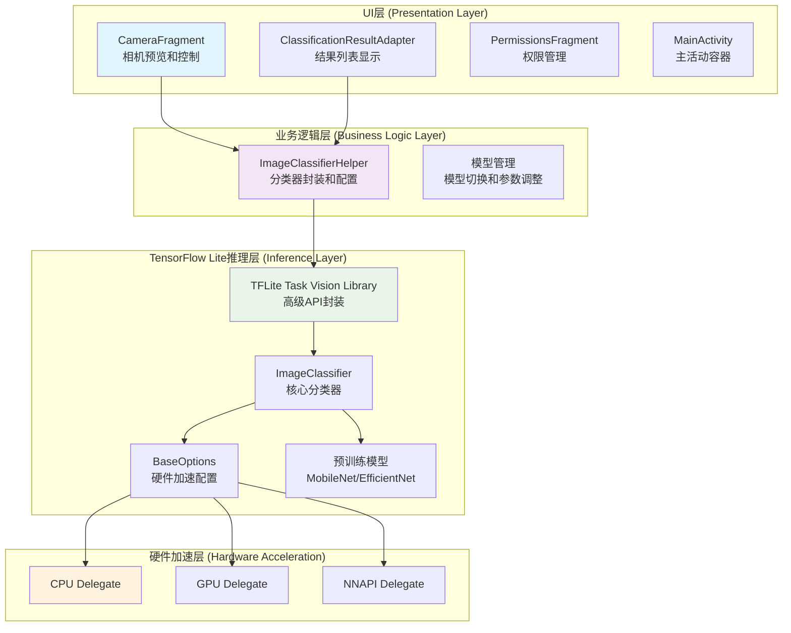
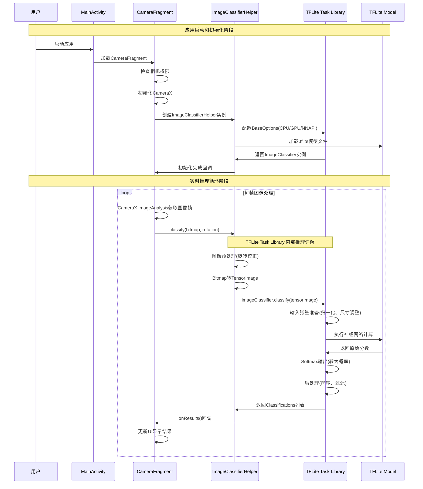
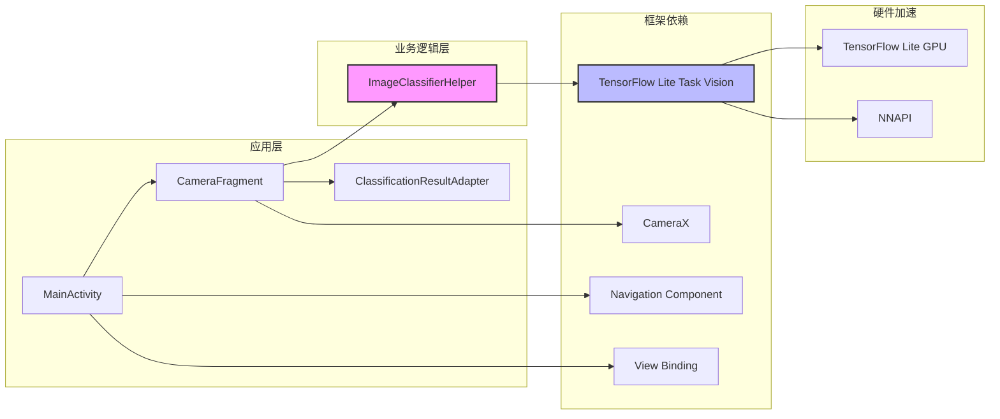

# 项目介绍：TFLite 图像分类 Android 示例

## 1. 项目基本介绍

本项目是一个基于 TensorFlow Lite (TFLite) 的 Android 图像分类应用程序。它演示了如何使用 TFLite 在 Android 设备上对图像进行实时分类。

该应用程序的主要功能包括：

*   从设备的摄像头实时捕获视频流
*   使用预训练的 TFLite 模型对捕获的图像进行分类
*   在界面上显示分类结果和置信度
*   允许用户切换不同的模型（MobileNet V1, EfficientNet Lite0/1/2）和推理设备（CPU, GPU, NNAPI）
*   支持动态调整推理参数（线程数、置信度阈值、最大结果数）

### 1.1 支持的模型

项目支持以下预训练模型：
- **MobileNet V1** (`mobilenetv1.tflite`) - 轻量级模型，适合资源受限设备
- **EfficientNet Lite0** (`efficientnet-lite0.tflite`) - 平衡精度和效率
- **EfficientNet Lite1** (`efficientnet-lite1.tflite`) - 更高精度
- **EfficientNet Lite2** (`efficientnet-lite2.tflite`) - 最高精度

### 1.2 推理加速选项

- **CPU** - 默认选项，兼容性最好
- **GPU** - 利用设备GPU加速推理
- **NNAPI** - Android神经网络API，硬件加速

## 2. 项目整体架构

### 2.1 技术分层架构

项目采用经典的三层架构设计，职责分离清晰：



#### 层次详细说明：

1.  **用户界面 (UI) 层**
    *   **职责**: 负责展示摄像头预览、用户交互以及显示最终的分类结果
    *   **关键组件**:
        *   `CameraFragment`: 管理摄像头预览和图像捕获，实现CameraX集成
        *   `ClassificationResultAdapter`: 将分类结果展示在RecyclerView列表中
        *   `PermissionsFragment`: 处理相机权限请求
        *   `MainActivity`: 应用主窗口，使用Navigation组件管理Fragment
    *   **数据流**: UI层将摄像头捕获的图像帧传递给应用逻辑层

2.  **应用逻辑层**
    *   **职责**: 作为UI层和推理层之间的桥梁，协调数据处理和业务逻辑
    *   **关键组件**:
        *   `ImageClassifierHelper`: 封装所有TFLite相关的准备工作和调用，是本层的核心
        *   模型管理: 处理不同模型的切换和推理参数的动态调整
    *   **数据流**: 接收来自UI层的图像，调用推理层进行处理，然后将结果返回给UI层

3.  **TensorFlow Lite 推理层**
    *   **职责**: 执行实际的机器学习模型推理
    *   **关键组件**:
        *   `TFLite Task Vision Library`: 高级库，简化了图像分类任务的调用接口
        *   `ImageClassifier`: 核心分类器实例
        *   `BaseOptions`: 配置硬件加速选项
        *   预训练模型文件 (`.tflite`): 包含分类算法的神经网络模型
    *   **数据流**: 接收预处理图像，执行模型推理，返回分类结果

### 2.2 关键执行逻辑流程

核心的实时图像分类流程包含初始化和循环推理两个阶段：



#### 详细流程说明：

**阶段一：启动与初始化**
1.  **应用启动**: **作用**: 用户点击图标，启动应用进程。**为什么**: `MainActivity`作为应用入口，通过Navigation组件加载负责相机功能的`CameraFragment`，这是展示主界面的第一步。
2.  **权限检查**: **作用**: 检查应用是否已被授予相机使用权限。**为什么**: 相机是敏感权限，Android系统要求必须在运行时动态请求并获得用户授权后才能使用，这是保证用户隐私和安全的前提。
3.  **相机初始化**: **作用**: 配置并启动相机服务。**为什么**: 初始化CameraX，并绑定两个核心用例：`Preview`用例是为了让用户能看到实时预览画面；`ImageAnalysis`用例是为了在后台持续获取一帧帧的图像数据，用于后续的AI推理。
4.  **分类器初始化**: **作用**: 创建`ImageClassifierHelper`实例，完成TFLite模型的加载和配置。**为什么**: 这是一个关键的预加载步骤。在相机开始提供图像之前就完成模型加载，可以有效避免处理第一帧图像时因模型初始化而导致的卡顿，从而确保从一开始就提供流畅的实时推理体验。

**阶段二：实时推理循环**
1.  **图像捕获**: **作用**: CameraX的`ImageAnalysis`用例持续从相机硬件获取最新的图像帧。**为什么**: 这是为模型提供实时、连续输入数据的来源。只有不断获取新图像，才能实现“实时”分类。
2.  **推理请求**: **作用**: 对捕获到的每一帧图像，调用`imageClassifierHelper.classify()`方法。**为什么**: 这是从UI层向逻辑层发起“开始分析这张图”的明确指令，并将图像数据（`Bitmap`）和方向信息传递过去。
3.  **TFLite推理**: **作用**: 执行核心的AI模型计算。**为什么**: 这是整个流程的“大脑”，模型将在这里对输入的图像进行分析，并预测出它属于各个类别的可能性（详见2.3节）。
4.  **结果显示**: **作用**: 通过异步回调`onResults()`更新UI。**为什么**: 推理是耗时操作，如果直接在主线程执行会造成界面卡死。通过异步回调，可以在后台线程完成推理后，再安全地将结果（分类标签和置信度）交由主线程更新到`RecyclerView`上，既保证了UI流畅，又向用户展示了有价值的分类信息。

### 2.3 TensorFlow Lite 推理框架执行详解

TFLite推理过程是整个应用的核心，包含以下精细化步骤：

```mermaid
flowchart TD
    A[输入Bitmap图像] --> B[图像预处理]
    B --> B1[应用旋转变换<br/>Rot90Op]
    B1 --> B2[Bitmap转TensorImage]
    B2 --> C[TFLite Task Library]
    
    C --> D[ImageClassifier.classify]
    D --> E[输入张量准备]
    E --> E1["图像归一化<br/>(像素值 0-255 转为 0-1)"]
    E1 --> E2[尺寸调整<br/>(调整为 224x224)]
    E2 --> E3[通道顺序<br/>(确保为RGB排列)]
    
    E3 --> F[神经网络推理]
    F --> F1[卷积层计算]
    F1 --> F2[激活函数]
    F2 --> F3[池化操作]
    F3 --> F4[全连接层]
    F4 --> F5[Softmax输出]
    
    F5 --> G[后处理]
    G --> G1[置信度排序]
    G1 --> G2[阈值过滤]
    G2 --> G3[最大结果数限制]
    
    G3 --> H[返回Classifications]
    H --> I[UI显示更新]
    
    style A fill:#e3f2fd
    style F fill:#f3e5f5
    style H fill:#e8f5e8
```

#### 推理过程关键步骤：

**1. 图像预处理阶段 (ImageProcessor)**
*   **旋转变换 (`Rot90Op`)**: **作用**: 将图像旋转至“正向”。**为什么**: 手机摄像头传感器的物理方向是固定的，但用户可能横屏或竖屏持握设备。此步骤根据传感器方向与设备自然方向的差值进行旋转校正，确保模型接收到的图像方向与训练时一致，避免将“颠倒”或“侧向”的图像喂给模型而导致错误识别。
*   **Bitmap转TensorImage**: **作用**: 将Android原生的`Bitmap`对象转换为TFLite支持的`TensorImage`格式。**为什么**: `TensorImage`是TFLite Task Library推荐的图像容器，它为后续自动化、标准化的预处理步骤（如归一化、尺寸调整）提供了便利的基础。本质是**从显示格式向推理格式的适配转换**

**2. 输入张量准备 (Task Library 内部自动执行)**
*   **图像归一化**: **作用**: 将图像的像素值从0-255范围转换到模型期望的范围（通常是0-1或-1到1）；将像素值从原始范围映射到标准范围的过程。**为什么**: 绝大多数图像模型在训练时都使用了归一化后的数据。为了获得准确的预测结果，推理时输入的数据必须经过完全相同的预处理。否则，数据分布的巨大差异将导致模型输出无意义的结果。具体说明：1、保证训练与推理数据分布一致性，2、提高数值计算稳定性，3、加速模型收敛（训练阶段）
*   **尺寸调整**: **作用**: 将任意尺寸的输入图像调整为模型要求的固定尺寸（例如224x224）。**为什么**: 神经网络的输入层大小是固定的。无论摄像头原始分辨率多大，Task Library都会自动将图像进行缩放或裁剪，以严格匹配模型输入层的维度要求。

**3. 核心推理执行 (神经网络计算)**
*   **神经网络计算**: **作用**: 执行模型的核心计算。**为什么**: 预处理好的图像数据（即“张量”）被送入神经网络，经过一系列复杂的数学运算（如卷积、激活、池化、全连接等），逐层提取图像特征，并最终在输出层生成一个包含所有可能类别及其对应原始分数的列表。
*   **Softmax输出**: **作用**: 将输出层的原始分数转换为概率分布。**为什么**: 原始分数可能难以解释，Softmax函数能将其转换为0到1之间、总和为1的概率值，这样每个值就可以直观地理解为“模型认为图像属于该类别的置信度”。

**4. 结果后处理 (Task Library 内部自动执行)**
*   **排序、过滤与限制**: **作用**: 将模型海量的原始输出转化为对用户有价值的、简洁的信息。**为什么**: 模型会为数千个类别都给出一个概率值。后处理步骤会：① **排序**：按置信度从高到低排列；② **过滤**：剔除掉低于设定阈值（如50%）的结果；③ **限制**：只保留用户需要的几个最高概率的结果（如Top 3）。这样，返回给App的就是一个干净、有序且高度相关的最终结果列表，而不是难以理解的原始数据。

**5. 性能优化机制**
- **异步推理**: 推理在后台线程执行，避免阻塞UI
- **帧率控制**: 通过时间戳控制推理频率，避免过度计算
- **内存管理**: 复用Bitmap缓冲区，减少GC压力

## 3. 项目关键文件介绍

### 3.1 源码文件结构

```
app/src/main/java/org/tensorflow/lite/examples/imageclassification/
├── MainActivity.java                    # 主活动，应用入口点
├── ImageClassifierHelper.java          # TFLite分类器封装类
└── fragments/
    ├── CameraFragment.java             # 相机预览和推理控制
    ├── ClassificationResultAdapter.java # 结果列表适配器
    └── PermissionsFragment.java        # 权限请求处理
```

#### 3.1.1 `ImageClassifierHelper.java` - 核心分类器封装

这是项目的核心类，封装了所有与TensorFlow Lite交互的逻辑。

**主要功能**:
- 根据用户选择配置和初始化TFLite的`ImageClassifier`
- 提供`classify()`方法进行图像预处理和分类
- 通过`ClassifierListener`接口异步传递分类结果

**关键常量定义**:
```java
private static final int DELEGATE_CPU = 0;      // CPU推理
private static final int DELEGATE_GPU = 1;      // GPU加速
private static final int DELEGATE_NNAPI = 2;    // NNAPI加速
private static final int MODEL_MOBILENETV1 = 0; // MobileNet V1
private static final int MODEL_EFFICIENTNETV0 = 1; // EfficientNet Lite0
private static final int MODEL_EFFICIENTNETV1 = 2; // EfficientNet Lite1
private static final int MODEL_EFFICIENTNETV2 = 3; // EfficientNet Lite2
```

**核心方法**:
- `setupImageClassifier()`: 根据配置创建分类器实例
- `classify(Bitmap image, int imageRotation)`: 执行图像分类
- `clearImageClassifier()`: 清理资源

#### 3.1.2 `CameraFragment.java` - 相机和UI控制

负责处理所有与相机相关的操作和UI显示。

**主要功能**:
- 集成CameraX进行相机预览和图像分析
- 实现`ImageClassifierHelper.ClassifierListener`接口
- 管理UI控件和用户交互

**关键组件**:
- `ProcessCameraProvider`: CameraX相机提供者
- `ImageAnalysis`: 图像分析用例，用于实时推理
- `Preview`: 相机预览用例
- `ExecutorService`: 后台线程执行器

#### 3.1.3 `ClassificationResultAdapter.java` - 结果显示适配器

RecyclerView适配器，用于显示分类结果列表。

**功能**:
- 展示分类标签和置信度
- 动态更新结果列表
- 处理结果项的视觉样式

### 3.2 资源文件

#### 3.2.1 布局文件 (`res/layout/`)

- **`activity_main.xml`**: 主活动布局，包含Fragment容器
- **`fragment_camera.xml`**: 相机Fragment布局，包含PreviewView和结果显示
- **`info_bottom_sheet.xml`**: 底部控制面板，包含模型选择和参数调整
- **`item_classification_result.xml`**: 分类结果列表项布局

#### 3.2.2 模型文件 (`assets/`)

通过`download_models.gradle`自动下载的预训练模型：
- `mobilenetv1.tflite` (约4.3MB)
- `efficientnet-lite0.tflite` (约6.6MB)  
- `efficientnet-lite1.tflite` (约10.1MB)
- `efficientnet-lite2.tflite` (约11.8MB)

### 3.3 配置文件

#### 3.3.1 `build.gradle` (app-level)

**关键配置**:
```gradle
android {
    compileSdk 32
    minSdk 23                    // 最低支持Android 6.0
    targetSdk 32
    
    buildFeatures {
        viewBinding true         // 启用View Binding
    }
    
    androidResources {
        noCompress 'tflite'     // 防止压缩.tflite文件
    }
}
```

**核心依赖**:
```gradle
// TensorFlow Lite相关
implementation 'org.tensorflow:tensorflow-lite-task-vision:0.4.0'
implementation 'org.tensorflow:tensorflow-lite-gpu:2.9.0'
implementation 'org.tensorflow:tensorflow-lite-gpu-delegate-plugin:0.4.0'

// CameraX相关
def camerax_version = '1.2.0-alpha04'
implementation "androidx.camera:camera-core:$camerax_version"
implementation "androidx.camera:camera-camera2:$camerax_version"
implementation "androidx.camera:camera-lifecycle:$camerax_version"
implementation "androidx.camera:camera-view:$camerax_version"

// Navigation组件
implementation 'androidx.navigation:navigation-fragment-ktx:2.5.1'
implementation 'androidx.navigation:navigation-ui-ktx:2.5.1'
```

#### 3.3.2 `download_models.gradle` - 模型自动下载

独立的Gradle脚本，负责构建时自动下载模型文件。

**执行机制**:
- 通过`preBuild.dependsOn`在构建前执行
- 使用`de.undercouch.download`插件下载文件
- 设置`overwrite false`避免重复下载

**下载任务示例**:
```gradle
task downloadModelFile(type: Download) {
    src 'https://storage.googleapis.com/download.tensorflow.org/models/tflite/...'
    dest project.ext.ASSET_DIR + '/mobilenetv1.tflite'
    overwrite false
}
```

### 3.4 项目依赖关系图



## 4. 项目特点与技术亮点

### 4.1 架构设计优势

- **分层架构清晰**: UI层、业务逻辑层、推理层职责分离，便于维护和扩展
- **异步处理**: 推理在后台线程执行，保证UI流畅性
- **资源管理**: 合理的生命周期管理，避免内存泄漏
- **配置灵活**: 支持运行时切换模型和硬件加速选项

### 4.2 性能优化策略

- **硬件加速**: 支持CPU、GPU、NNAPI多种推理后端
- **模型选择**: 提供不同精度和速度的模型选项
- **帧率控制**: 智能控制推理频率，平衡性能和功耗
- **内存优化**: 复用图像缓冲区，减少GC压力

### 4.3 用户体验设计

- **实时反馈**: 毫秒级推理响应，流畅的用户体验
- **直观界面**: 清晰的结果展示和参数调整界面
- **权限处理**: 优雅的相机权限请求流程
- **错误处理**: 完善的异常处理和用户提示

## 5. 开发和部署建议

### 5.1 开发环境要求

- **Android Studio**: 2021.2.1 (Chipmunk) 或更新版本
- **最低SDK**: API 23 (Android 6.0)
- **目标SDK**: API 32 (Android 12L)
- **物理设备**: 建议使用真机测试，模拟器性能有限

### 5.2 性能调优建议

1. **模型选择策略**:
   - 资源受限设备: 使用MobileNet V1
   - 平衡性能: 使用EfficientNet Lite0
   - 追求精度: 使用EfficientNet Lite1/2

2. **硬件加速配置**:
   - 优先尝试G
